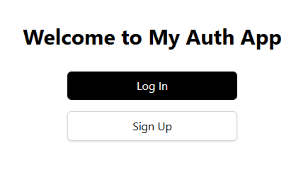
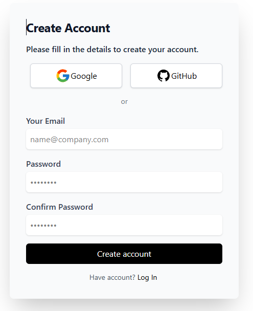
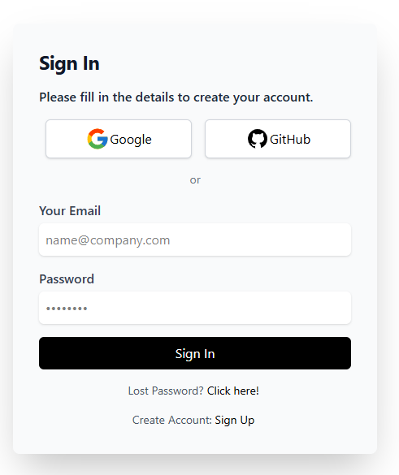
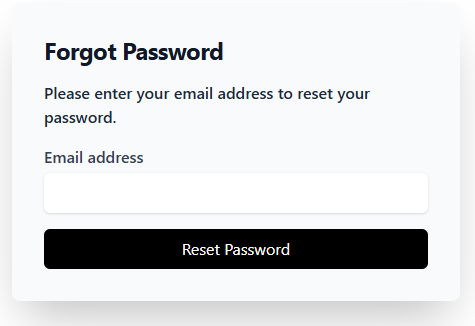
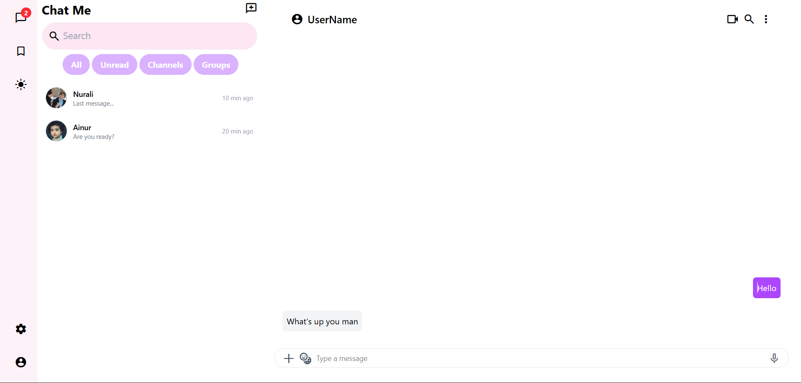

# 🔐 React Auth App (with Vite)

A clean and modular **authentication system** built using **React** and **Vite**, designed for speed, scalability, and learning modern React best practices.

> Features include: user sign-up, login, password recovery, and secure state handling — all styled for a smooth UI experience.

---

## 🚀 Tech Stack

- ⚛️ **React** – Component-based frontend UI
- ⚡ **Vite** – Super fast dev environment with HMR
- 🎯 **ESLint** – Code quality and consistency
- 🎨 **CSS/SCSS** – Clean and responsive styling (or Tailwind if you're using it)
- 🔐 **Authentication flow** – Signup, Signin, and Forgot Password pages

---

## 📸 Screenshots

### 🖥 Welcome Page



### 📝 Sign Up Page



### 🔐 Sign In Page



### ❓ Forgot Password Page



### Chat App

## 

## 🛠️ Getting Started

### Install dependencies:

```bash
npm install
```

### Start the app in dev mode:

```bash
npm run dev
```

### Build for production:

```bash
npm run build
```

---

## 🧠 Key Concepts Used

- React Hooks (`useState`, `useEffect`)
- Conditional rendering and controlled inputs
- Route-based navigation (if using `react-router-dom`)
- Form validation basics
- Modular, reusable component structure

---

## ✅ Future Improvements

- Add backend integration (Firebase, Supabase, or custom API)
- Form validation with Yup or React Hook Form
- Persistent sessions (e.g., JWT, cookies)
- Password strength meter and visibility toggle

---

## 💡 Inspiration

This app is a great starting point for anyone learning React or building a scalable frontend login system. Whether for personal learning or portfolio projects, it’s structured to grow.

---
